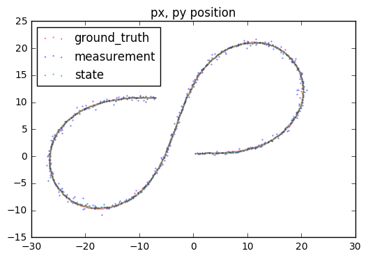

```python
import pandas as pd
import matplotlib.pyplot as plt

%matplotlib inline
```


```python
F = pd.read_csv("data/output.txt", sep = '\t')
```


```python
F.columns

# F[F["sensor_type"]=="lidar"]
```


    Index(['time_stamp', 'px_state', 'py_state', 'v_state', 'yaw_angle_state',
           'yaw_rate_state', 'sensor_type', 'NIS', 'px_measured', 'py_measured',
           'px_ground_truth', 'py_ground_truth', 'vx_ground_truth',
           'vy_ground_truth'],
          dtype='object')


```python
plt.subplot(311)

plt.plot(list(F.index.values), F["NIS"])

plt.subplot(312)
plt.title("Lidar NIS")
plt.plot(list(F[F["sensor_type"]=="lidar"].index.values), F[F["sensor_type"]=="lidar"]["NIS"])

plt.subplot(313)
plt.title("Radar NIS")
plt.plot(list(F[F["sensor_type"]=="radar"].index.values), F[F["sensor_type"]=="radar"]["NIS"])

plt.tight_layout()
```


```python
plt.scatter(F["px_ground_truth"], F["py_ground_truth"], color = 'r', s = 0.1, label = 'ground_truth')
plt.scatter(F["px_measured"], F["py_measured"], color = 'b', s=0.1, label = 'measurement')
plt.scatter(F["px_state"], F["py_state"], color = 'g', s=0.1, label = 'state')
plt.title("px, py position")
plt.legend(loc = 'upper left')
```


    <matplotlib.legend.Legend at 0x116e1e278>





```python

```
